

  

<h3 align="center">
  Atividades de 2026 da matéria do curso de Programação de Aplicativos Mobiles.
</h3>
  

# ★ Telas do Projeto - Persona Spokeo ★

  

| Tela Login | Tela de Cadastro | Tela Home |
|------------------|--------------------------|-------------------------|
| 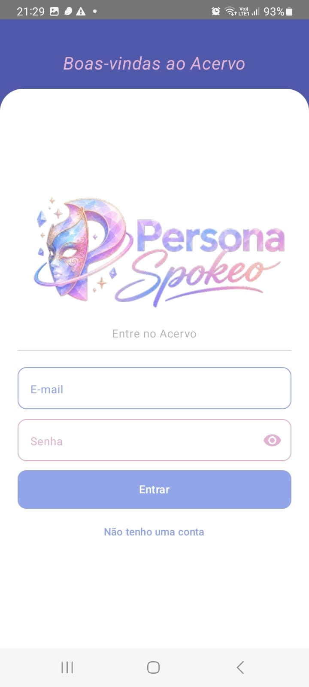 | 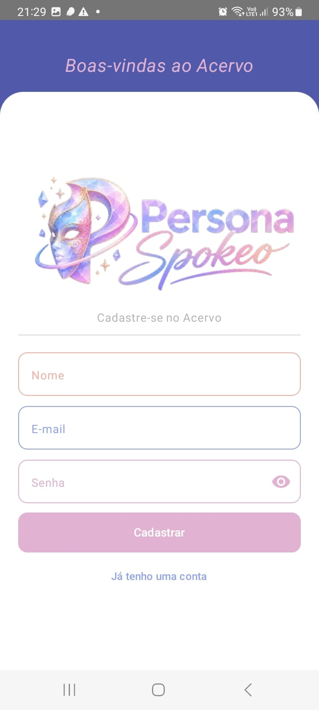 |  |
 

| Card de Dados | Tela de Favoritos | Tela de Favoritos Vazia|
|------------------|--------------------------|-------------------------|
| 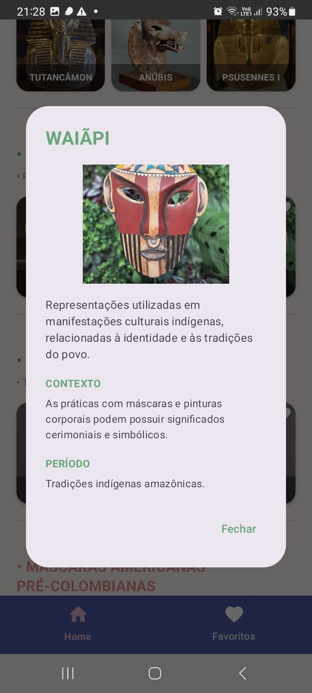 | 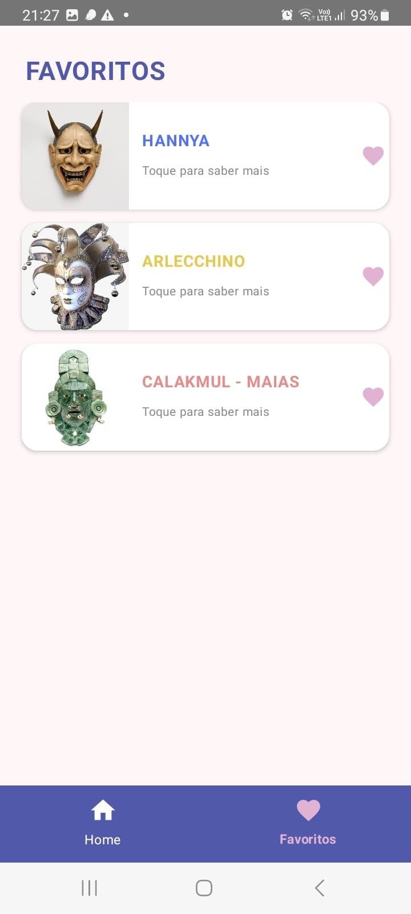 | 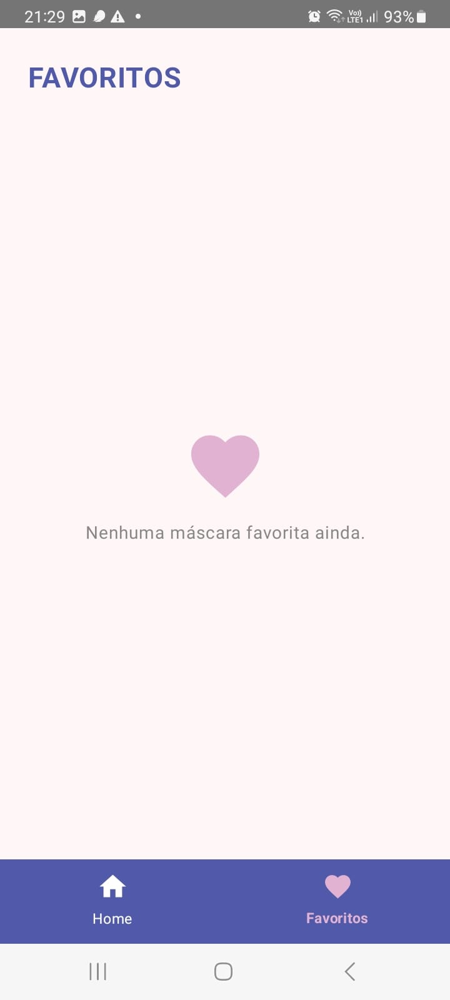 |

<h3>Usuários salvos no Firebase</h3>
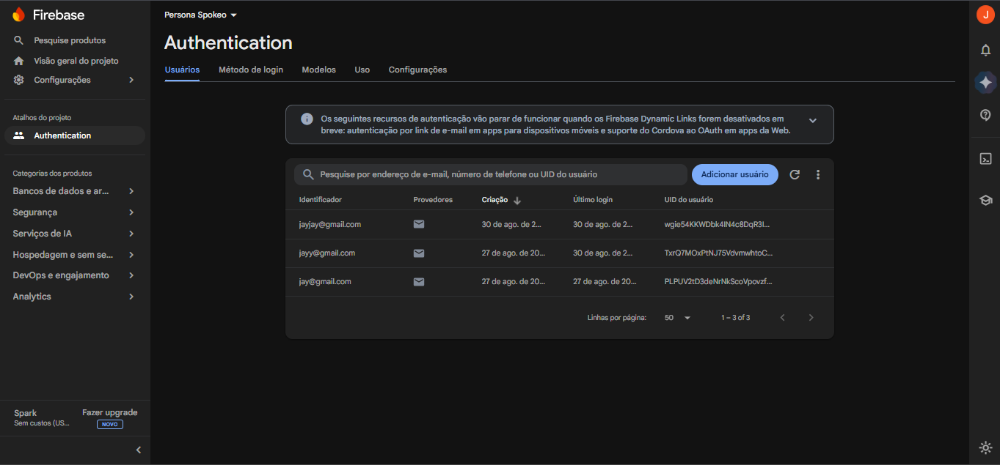

  

  
# ★ Telas do Projeto - Subly ★

  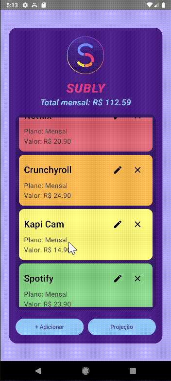

| Tela Inicial | Tela de Cadastro | Tela de Login |
|------------------|--------------------------|-------------------------|
| 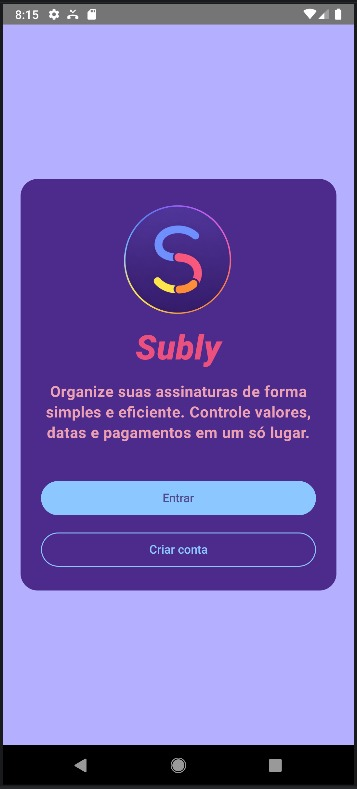 | 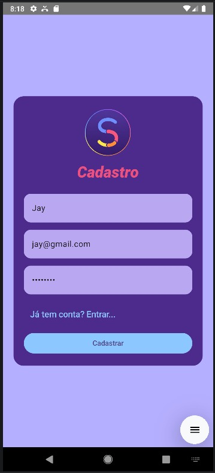 | 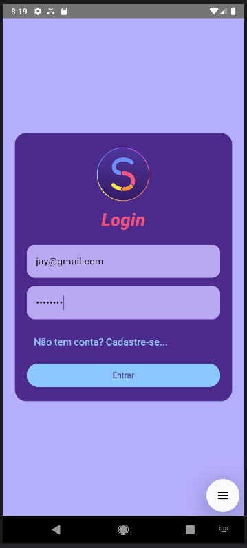 |
 

| Tela de Adicionar | Tela Home | Tela de Projeção |
|------------------|--------------------------|-------------------------|
| 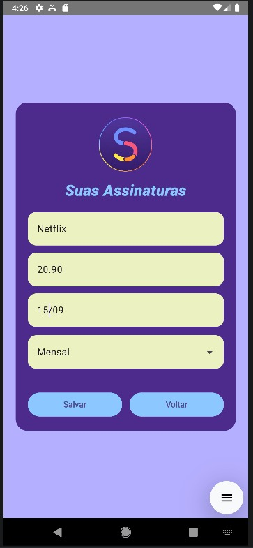 | 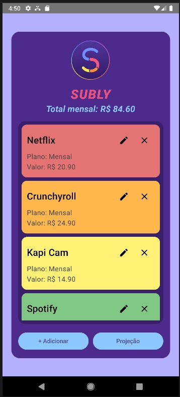 | 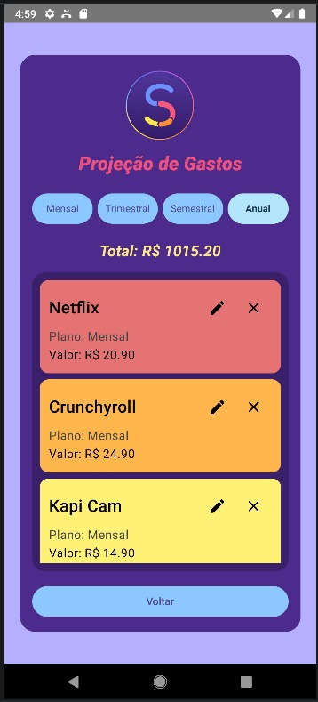 |

  

# ★ Tela do Projeto - FoodReview ★
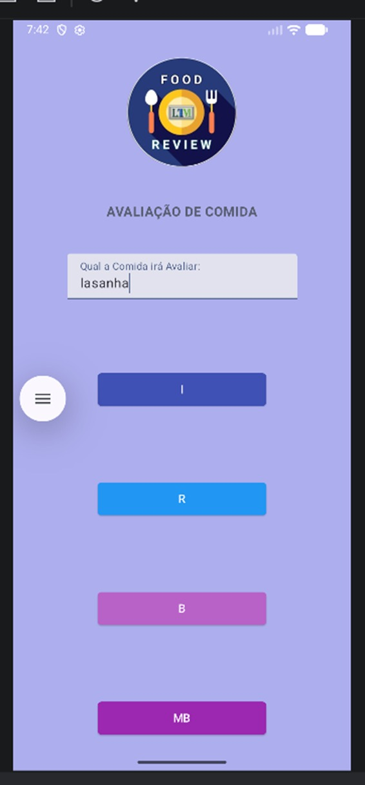 

##

 

