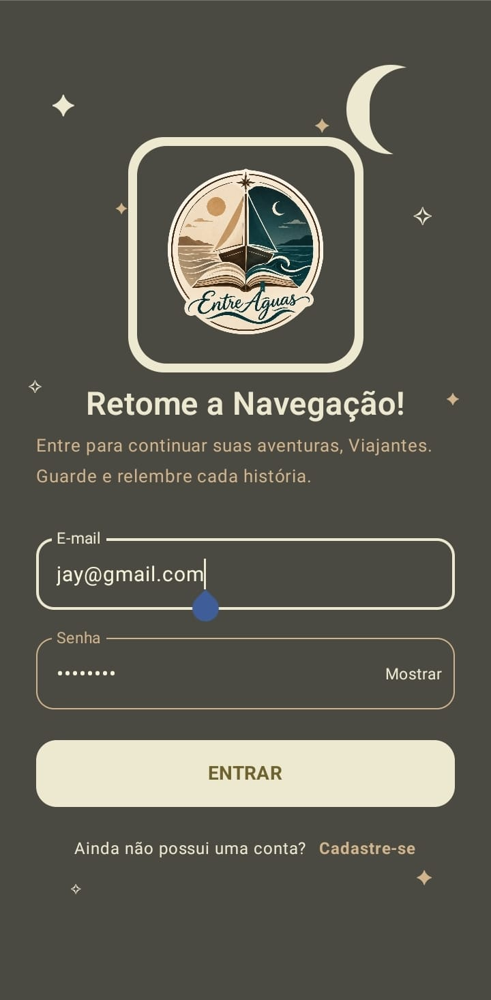
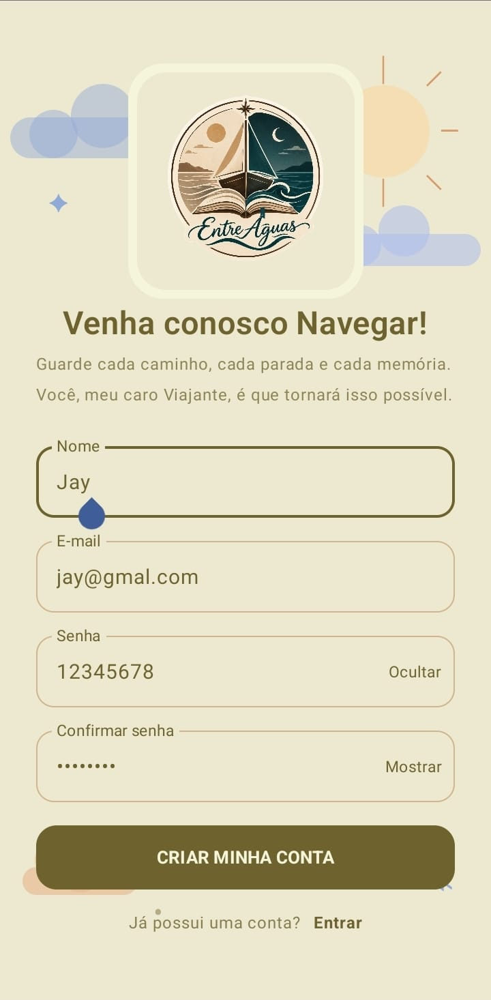
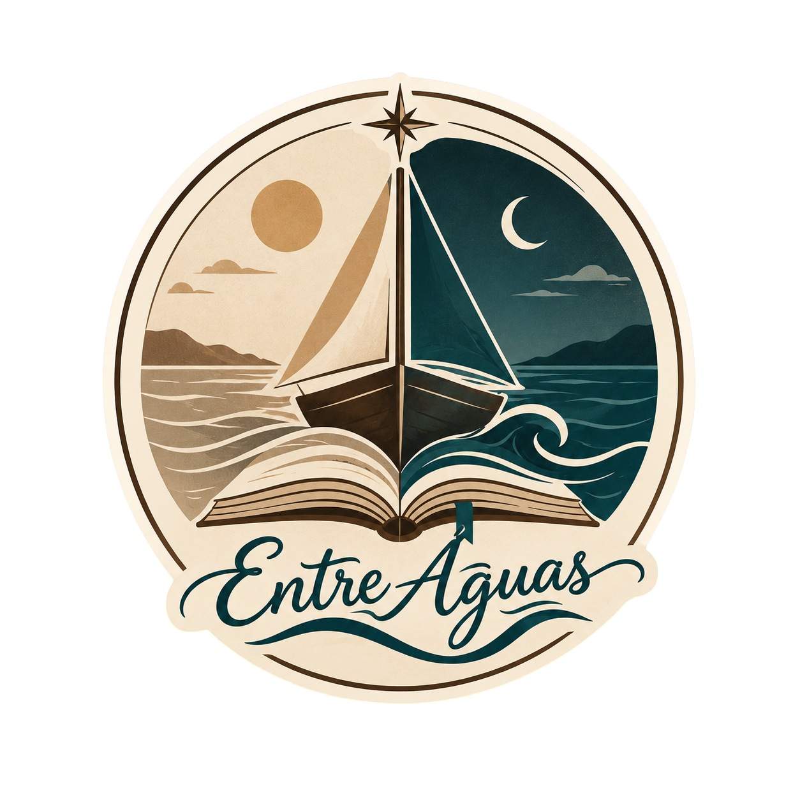
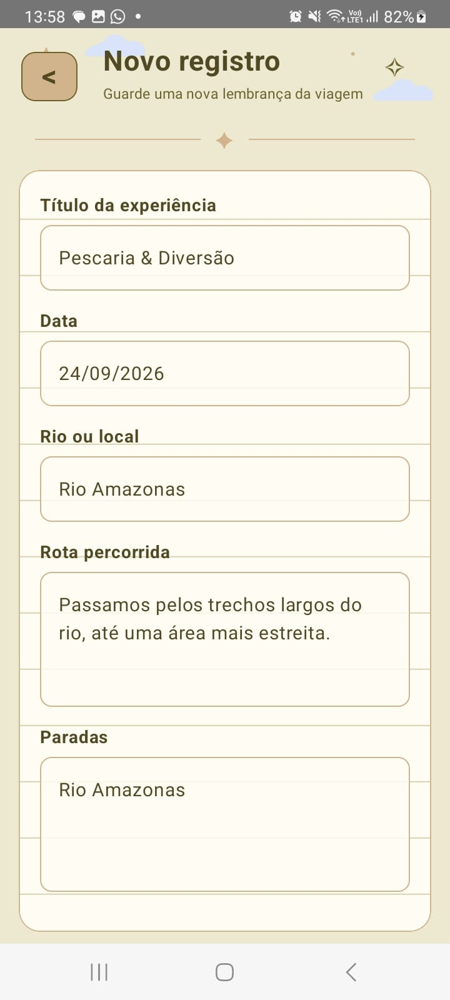
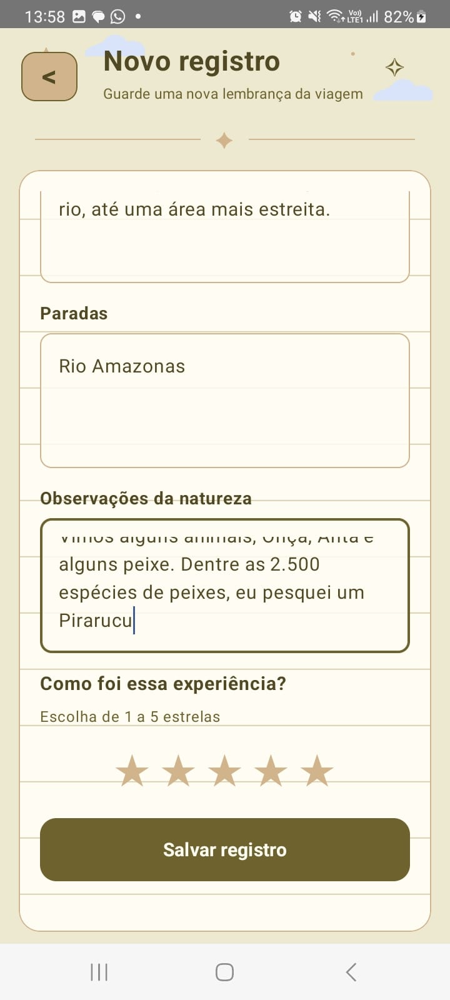
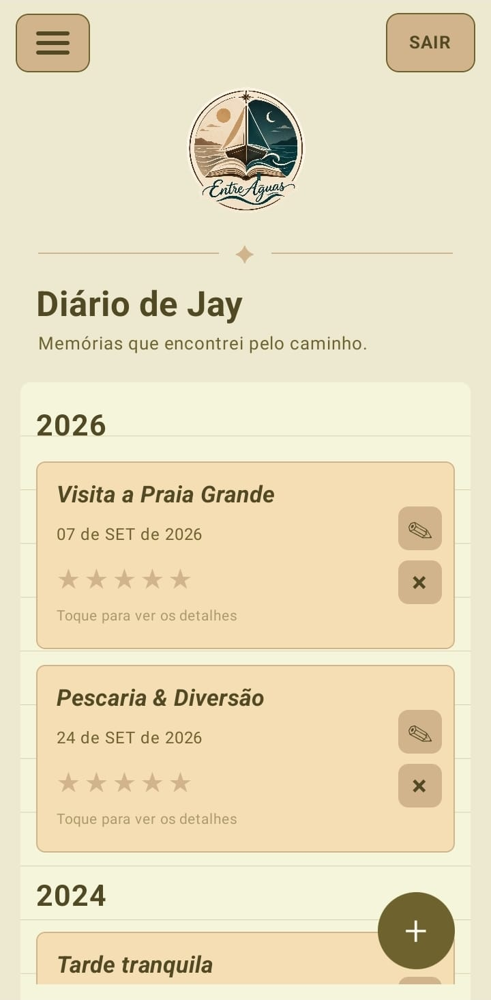
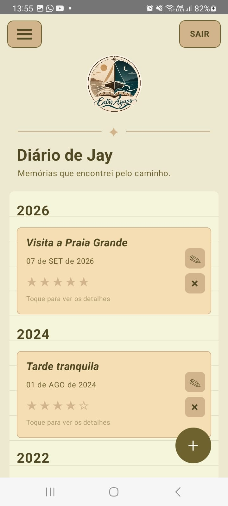
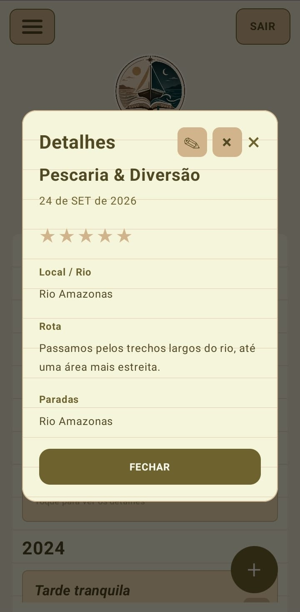

  

<h3 align="center">
  Atividades de 2026 da matéria do curso de Programação de Aplicativos Mobiles.
</h3>
   

  
# ★ Telas do Projeto - Entre Águas★

  

 

## Sobre o aplicativo

O Entre Águas é um aplicativo desenvolvido com a proposta de funcionar como um diário de navegação e passeios.

O aplicativo permite registrar e organizar memórias relacionadas a viagens de barco, rios navegados, paradas realizadas e observações da natureza encontradas durante os passeios.

A proposta é proporcionar uma forma simples e organizada de guardar essas experiências, utilizando uma identidade visual inspirada em diários de viagem e navegação.

 

## Funcionalidades

- Cadastro e login de usuários;
- Registro da data do passeio e locais visitados.
- Descrição da rota realizada e das paradas;
- Observações sobre a natureza;
- Avaliação do passeio utilizando estrelas;
- Armazenamento dos dados no Firebase Firestore.

## CRUD
- Criação (CREATE): cadastro de novos registros de viagens no diário de navegação.
- Visualização (READ): consulta dos registros salvos e dos detalhes de cada viagem.
- Edição (UPDATE): alteração das informações de registros existentes.
- Exclusão (DELETE): remoção de registros do diário.

 

## Tecnologias utilizadas

- Kotlin
- Android
- Jetpack Compose
- Firebase Authentication
- Firebase Firestore
- Android Studio

 

## Estrutura do aplicativo

O aplicativo possui as seguintes telas principais:

- **Login:** acesso do usuário à aplicação.
- **Cadastro:** criação de uma nova conta.
- **Home:** exibição dos registros do diário.
- **Registro:** criação e edição das informações de uma viagem.

 

## Banco de dados

Os registros são armazenados no **Firebase Firestore**.

Cada registro contém informações como:

- Título;
- Data;
- Local/Rio;
- Rota;
- Paradas;
- Observações da natureza;
- Avaliação em estrelas;
- Identificação do usuário.

 

## Identidade visual

A identidade visual do Entre Águas foi inspirada em diários de navegação e passeios.

A interface utiliza tons de:

- Bege;
- Marrom;
- Azul;
- Verde;
- Lilás.

A logo e os elementos visuais remetem à navegação, viagens e registros de memórias.

 

## Objetivo

O objetivo do aplicativo é permitir que o usuário registre suas experiências de navegação e passeios, mantendo organizadas as informações sobre os locais visitados, as rotas realizadas, as paradas e as observações feitas durante cada viagem.

## Tabela - Telas Entre Águas

| Tela Login | Tela de Cadastro | Logo do Projeto |
|:---:|:---:|:---:|
|  |  |  |

 

| Tela de Registro 01 | Tela de Registro 02 |
|:---:|:---:|
|  |  |

 

| Tela Home (Antes) | Tela Home (Depois) | Card de Dados |
|:---:|:---:|:---:|
|  |  |  |

 

    

# ★ Telas do Projeto - Persona Spokeo ★

  

<h3>Meu tema foi: </h3> <h2>MÁSCARAS CULTURAIS</h2>

<h3>Onde eu deveria criar um app com um acervo fotográfico de uma gama de máscaras de uso rituálistico ou teatrais de distintas culturas, povos e lugares</h3>

  

  
| Tela Login | Tela de Cadastro | Tela Home |
|------------------|--------------------------|-------------------------|
|  |  |  |
 

| Card de Dados | Tela de Favoritos | Tela de Favoritos Vazia|
|------------------|--------------------------|-------------------------|
|  |  |  |

<h3>Usuários salvos no Firebase</h3>

<h3>ARQUIVOS DO PROJETO</h3>

<h4>Login: Tela de entrada do usuário utilizando e-mail e senha.</h4>

<h4>Cadastro: Tela para criação de uma nova conta integrada ao Firebase Authentication.</h4>

<h4>Home + Cards: Tela principal do acervo com as culturas e os cards das máscaras.</h4>

<h4>Favoritos: Tela que reúne as máscaras marcadas como favoritas pelo usuário.</h4>

<h4>AuthViewModel: Responsável pelo gerenciamento da autenticação do usuário.</h4>

<h4>MainActivity: Ponto de entrada principal do aplicativo.</h4>

<h4>MyAppNavigation: Responsável pela navegação entre as telas do aplicativo.</h4>

  

# ★ Telas do Projeto - Subly ★

  

| Tela Inicial | Tela de Cadastro | Tela de Login |
|------------------|--------------------------|-------------------------|
|  |  |  |
 

| Tela de Adicionar | Tela Home | Tela de Projeção |
|------------------|--------------------------|-------------------------|
|  |  |  |

  

# ★ Tela do Projeto - FoodReview ★
 

##

 

